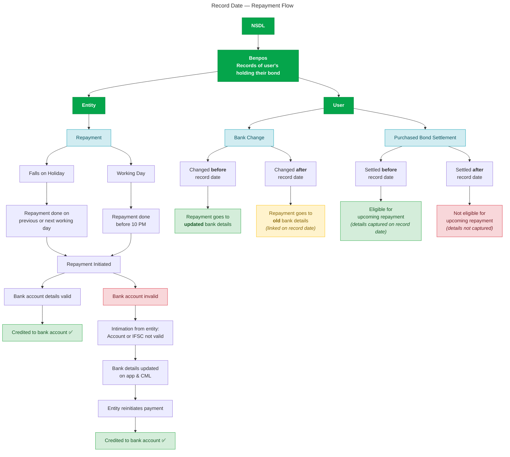

## Background: How record date affects repayments

The record date is the cut-off date NSDL shares who holds a bond (via Benpos). Whoever holds the bond on that date gets the repayment, and it goes to whichever bank account was linked to their CML on that date, not whatever they have linked today.

This matters because nearly every "repayment not received" ticket traces back to one of these:

* User bought the bond after the record date (not entitled this cycle)
* Repayment date shifted due to a bank holiday
* User changed their bank account around the record date (payment went to the old one)
* Bank account/IFSC became invalid

  \

---

## Step 1: Check if the user held the bond on the record date

**Where to check:** 

1. Finder → Order Settlement date
2. NSDL Transaction statement or Holdings statement

\nIf the user bought / order settled **after** the record date, they are not entitled to this repayment cycle. Their purchase settled after the Benpos snapshot was taken, so they will be eligible starting the next cycle. This is expected behavior. Inform the user and close the ticket.

They might be bought the bond at discount for period they will hold till next repayment cycle start as they will not get this cycle’s repayment.

:::info
If the user held the bond on or before the record date, move to Step 2.

:::

---

## Step 2: Confirm if the repayment date has actually passed

**Where to check:**

1. Finder → Repayments
2. Master report / **#asset-repayments-coverpool**

Three scenarios here:

**Repayment date is today (working day):** Repayments are processed before 10 PM. If the user is reaching out before end of day, ask them to wait till 10 PM and check again.

**Repayment date falls on a holiday:** The entity processes the payment on the previous or next working day. Don't assume which one, verify it (see below).

**Repayment date has passed:** Move to Step 3.

### How to verify the actual payment date

Don't guess whether the entity paid early or late around a holiday. Verify it from Slack.

Wint holds \~2% of every bond issued on the platform, so we receive the same repayment as any other investor for that ISIN. 

1. Go to **#asset-repayments-coverpool** on Slack
2. Search the channel for the ISIN
3. You'll find a **Repayments (APP)** automation message listing the due date and amount for that ISIN
4. Open the thread on that message. The team posts the actual bank statement entry once the entity pays: transaction date, NEFT/RTGS reference, and amount
5. That transaction date is the actual date every investor in that ISIN (including the user) would have received their payout

 

In the example above, bonds due on 13-07-2026 (Sunday) were paid out on 13-07-2026 itself. The thread reply shows the NEFT/RTGS entries with reference numbers confirming receipt. Use this to tell the user exactly when the payment was processed.

---

## Step 3: Check if the user changed their bank account around the record date

**Where to check:** 

1. Finder → SEBI KYC → Bank account change

| When they changed | Where the payment goes | What to tell user |
|-------------------|------------------------|-------------------|
| Before record date | Updated (new) account  | Payment should be in the new account. If not, move to Step 4 |
| After record date | Old account (linked on record date) | Payment was sent to the account they had on record date, not the new one. Ask them to check the old account |
| No change         | Current account        | Move to Step 4    |

If the user changed their bank after the record date, the payment going to the old account is expected behavior. Explain this clearly: Issuer capture the bank details as of the record date from NSDL, and any changes made after that only apply from the next repayment cycle.

---

## Step 4: Validate bank account and IFSC

**Where to check:**

1. Finder → Repayments
2. Slack → **#asset-repayments-coverpool**
3. User → bank statement

If Steps 1 through 3 are all clear, the most likely cause is an invalid bank account or IFSC. This is especially common after bank mergers (for example, a bank changing all its IFSC codes post-merger while the user's CML still has the old one).

**If a bounce intimation exists:**

1. Tell the user their bank details need to updated.
2. Guide them to update bank details on the Wint platform.
3. Get updated CML & Raise a repayment issue.

---

## Step 5: Raise a repayment issue

If you've gone through Steps 1 to 4 and confirmed all of the following:

* User held the bond on the record date
* Repayment date has passed (no holiday/cutoff explanation)
* Bank account was unchanged or changed before the record date

Then this is a genuine processing issue. Raise it formally.

**How to raise:**

1. Go to **#asset_repayment_issues** on Slack
2. Type `/Raise Repayment Issue` in the message box
3. Select the **Raise Repayment Issue** workflow from the popup
4. Fill in the workflow form with: ISIN, user ID, record date, repayment date, and a brief note on what you've already checked (so the ops team doesn't retrace your steps)

Do not raise an issue in this channel unless you've completed Steps 1 through 4. Most tickets resolve before reaching this point.

---

## Quick reference

| User says | Likely cause | Where to check | Action |
|-----------|--------------|----------------|--------|
| "I bought the bond recently and haven't been paid" | Bought after record date | Finder → holding history | Not eligible this cycle, explain and close |
| "Payment date passed, nothing received" | Holiday shift or same-day before 10 PM | Finder → holiday calendar, then Slack #asset-repayments-coverpool for actual date | Share the confirmed processing date |
| "I changed my bank account, payment is missing" | Bank change after record date | Account change history vs record date | Payment went to old account, explain |
| "Bank account is correct but not received" | IFSC invalid | User CML current updated bank statement | Ask user to Update details on app & raise in #asset_repayment_issues via `/Raise Repayment Issue` |
| All checks clear, still not received | Processing gap | Steps 1-4 confirmed | Raise in #asset_repayment_issues via `/Raise Repayment Issue` |
